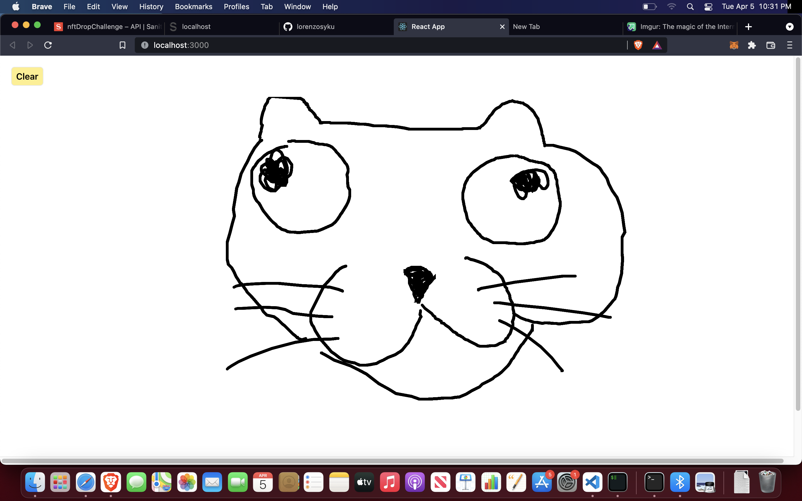

# Drawing React App

This project was bootstrapped with [Create React App](https://github.com/facebook/create-react-app) and [tailwindcss](https://tailwindcss.com) for styling.

This is a simple app that allows the user to draw using the cursor and there is a button to clear the drawing.

## Preview
